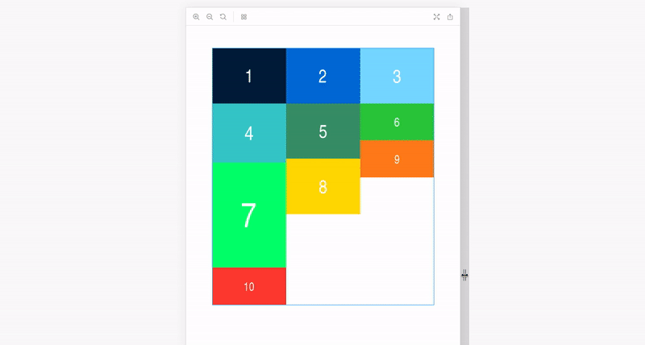

# 🏛 react-columned
[](https://travis-ci.org/doitadrian/react-columned)
[](https://coveralls.io/github/doitadrian/react-columned?branch=master)
[](https://www.npmjs.com/package/react-columned) 
[](https://www.npmjs.com/package/react-columned)

[](https://github.com/prettier/prettier)
[](#contributors)
[](http://makeapullrequest.com)
  
A component that, based on container's width, sorts given child nodes into a preferred number of columns. 



## Install
```
npm install --save react-columned
```

Or if you prefer yarn: 
```
yarn add react-columned
```

## Quick Example:
Sort images into columns. Use default `columns` configuration. 

```javascript
import Columned from "react-columned";
```

```javascript
<Columned>
  
  
  
  
  
  
  
  
  
  
</Columned>;

```

Visit https://react-columned.netlify.com to see it live in action.

## How it works
The component uses [element-resize-detector](https://www.npmjs.com/package/element-resize-detector) 
(which is the only dependency of this package) to get the  
container's width. Based on received result, it then sorts the child 
nodes into a needed number of columns, which are simple inline-block divs.

## Props

| Prop                | Type                              | Default                                                      | Description                                                                                       |
| :------------------ | :-------------------------------- | :----------------------------------------------------------- | :------------------------------------------------------------------------------------------------ |
| `children`          | `React.Node`                      | null                                                         | Child nodes which are about to be sorted into columns                                             |
| `className`         | `?string`                         | undefined                                                    | Class to append on columns container.                                                             |
| `columns`           | `{ [string] : number } \| number`    | `{ "320": 1, "480": 2, "800": 3, "1366": 4, "1920": 6 }`     | Number of columns, per container size, eg. `{ "320": 1, "480": 2, "800": 3, "1366": 4 }`. If you need a fixed amount of columns, regardless of the screen size, just pass a number, eg. `4`. |

The default `{ "320": 1, "480": 2, "800": 3, "1366": 4, "1920": 6 }` 
translates to the following:
- `container <= 320px` : 1 column
- `321px <= container <= 480px`: 2 columns
- `481px <= container <= 800px`: 3 columns
- `801px <= container <= 1366px`: 4 columns
- `1367px <= container`: 6 columns

## Troubleshooting

If you're having visual issues, try applying the following two CSS rules 
on every child node:
```
display: 'block'; // Prevents spacing between child nodes in a column. 
width: 100% // Child nodes might be wider than the column, this prevents it.
```

You can easily do this by setting a class on the `<Columned>` component.
For example, if the child nodes are `img` elements (using [emotion](https://www.npmjs.com/package/emotion) for defining styles):

```
const columnedStyles = css({
    img: {
        display: "block",
        width: "100%"
    }
});
```

```
<Columned className={columnedStyles}>
    (...)
</Columned>
```

## Contributors

Thanks goes to these wonderful people ([emoji key](https://github.com/kentcdodds/all-contributors#emoji-key)):

<!-- ALL-CONTRIBUTORS-LIST:START - Do not remove or modify this section -->
<!-- prettier-ignore -->
| [<br /><sub><b>Adrian Smijulj</b></sub>](https://github.com/doitadrian)<br />[💻](https://github.com/doitadrian/react-columned/commits?author=doitadrian "Code") [📖](https://github.com/doitadrian/react-columned/commits?author=doitadrian "Documentation") [💡](#example-doitadrian "Examples") [👀](#review-doitadrian "Reviewed Pull Requests") [⚠️](https://github.com/doitadrian/react-columned/commits?author=doitadrian "Tests") |
| :---: |
<!-- ALL-CONTRIBUTORS-LIST:END -->

This project follows the [all-contributors](https://github.com/kentcdodds/all-contributors) specification. Contributions of any kind welcome!
